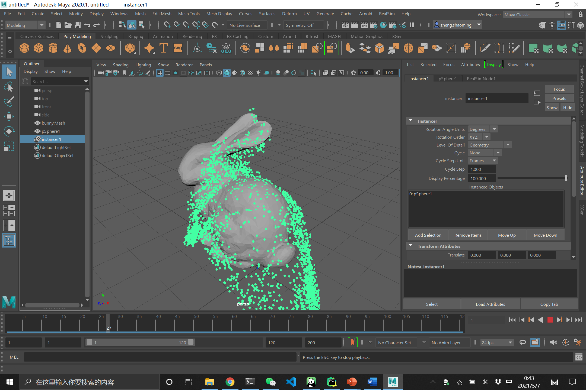
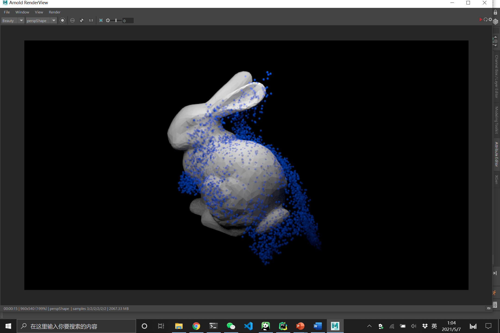

UPenn CIS-660 Authoring Tool by *Yihui Mao* and *Shaoming Zheng*. A 3D fluid particle simulation Maya node by reproducing Schechter, Hagit, and Robert Bridson. "Ghost SPH for animating water." ACM Transactions on Graphics (TOG) 31.4 (2012): 1-8.

# Demo

# Technical Approach

## Algorithm Details
The algorithm solves the particle deficiency at boundaries and eliminates artifacts by (1) dynamically seeding ghost particles in a layer of air around the liquid with a blue noise distribution, (2) extrapolating the right quantities from the liquid to the air and solid ghost particles to enforce the correct boundary conditions, and (3) using the ghost particles appropriately in summations. Mass, density, and velocity are assigned to ghost particles in the spirit of Fedkiw’s Ghost Fluid Method: if a quantity should be continuous across a boundary, it is left as is in the ghost; if it is decoupled and may jump discontinuously, the fluid’s value is instead extrapolated to the ghost.

## Maya Interface and Integration
We implement a Maya node which (1) takes the current polygon in the scene and the current time `t` as input, (2) consult the C++ OpenGL ghost SPH library to generate the current frame point cloud of liquid pouring (on the polygon) animation based on `t`, (3) render visible Maya object (presumably polygons or NURBS surface) based on the point cloud data.

# Usage

## Environment Setup

The system is developed with Windows 10, Maya 2020, OpenGL 3.3, and Microsoft Visual Studio 2019

Use Visual Studio to setup your Maya installation location in `RealSimCL.sln` correctly.

Setup the directory of `RealSim` in `RealSimNode.py`

## Load Node

(Optional) Customize the simulation parameters in `particles.cl`. Load the plugin by selecting `RealSimNode / RealSimNode.py` in Maya.

## Simulation

1. Import an arbitrary triangular mesh as a `.obj` file under the `mesh2pc` directory.
2. Select the mesh in Maya.
3. Click `RealSim / RealSim` on the menu bar to initiate the GPU-accelerated simulation task.
4. Now you get an animation, hit the play button. You can also:
    1. Export the animation. 
    2. Bind materials and render with Arnold.
    3. Or even adjust the number of particles in the `Display Percentage` setting of the `instancer`.
    4. Adjust the size (scale), color, transparency, material, and a number of other useful properties of the particles in the setting of `pSphere1`.
